# 🏙️ CivicEye AI

> **AI-Powered Civic Issue Reporting & Smart Urban Management System**

CivicEye AI is an intelligent web-based platform that enables citizens to report civic infrastructure problems using images. The system leverages Artificial Intelligence to automatically classify reported issues, capture location details, visualize complaints on interactive maps, and provide authorities with analytics for efficient decision-making.


---

# 📌 Table of Contents

- Project Overview
- Problem Statement
- Objectives
- Key Features
- How CivicEye AI Works
- Technology Stack
- Project Architecture
- Folder Structure
- Installation
- Running the Project
- Screenshots
- Future Scope
- Author

---

# 📖 Project Overview

Urban civic issues such as potholes, overflowing garbage bins, damaged roads, broken streetlights, and waterlogging often remain unresolved due to inefficient reporting systems and delayed communication between citizens and government authorities.

CivicEye AI provides an AI-driven digital solution where citizens can easily report issues by uploading images. The system automatically identifies the issue category, stores complaint information, visualizes complaints geographically, and provides an administrative dashboard for effective complaint management.

---

# ❗ Problem Statement

Traditional civic complaint systems suffer from:

- Manual complaint categorization
- Delayed response time
- Lack of transparency
- Poor complaint tracking
- Duplicate complaints
- Limited data-driven decision making

CivicEye AI addresses these challenges through Artificial Intelligence, automation, and interactive visualization.

---

# 🎯 Objectives

- Simplify civic issue reporting.
- Automate complaint categorization using AI.
- Improve communication between citizens and authorities.
- Enable smarter urban planning using analytics.
- Increase transparency and accountability.

---

# ✨ Key Features

## Citizen Features

- User Registration & Login
- Image Upload
- Complaint Submission
- Automatic Location Detection
- Complaint Status Management

## AI Features

- AI-Based Issue Classification
- Image Analysis
- Automatic Category Prediction

## Administration Features

- Admin Dashboard
- Complaint Management
- Status Updates
- Analytics Dashboard
- Interactive Maps
- Heatmap Visualization

---

# 🔄 How CivicEye AI Works

## Step 1 – User Registration & Login

Citizens securely register and log in to the platform.

---

## Step 2 – Report a Civic Issue

Users upload an image of the civic problem and can optionally provide a brief description.

---

## Step 3 – Automatic Location Detection

The platform captures the issue's GPS coordinates or allows users to manually select the location on the map.

---

## Step 4 – AI-Based Issue Detection

The AI model analyzes the uploaded image and automatically classifies the civic issue (Garbage Dump, Pothole, Waterlogging, Damaged Road, etc.).

---

## Step 5 – Complaint Submission & Secure Storage

The complaint details, uploaded image, AI prediction, and location are securely stored in the database.

---

## Step 6 – Authority Dashboard

Administrators can view, manage, and update complaints through a centralized dashboard.

---

## Step 7 – Complaint Status Management

Authorities update complaint status such as:

- Pending
- In Progress
- Resolved

---

## Step 8 – Interactive Maps & Heatmaps

Complaints are displayed on interactive maps and heatmaps to identify civic issue hotspots.

---

## Step 9 – Analytics Dashboard

Statistical charts and analytics help authorities understand complaint trends and make informed decisions.

---

# 🛠️ Technology Stack

## Frontend

- HTML5
- CSS3
- JavaScript

## Backend

- Python
- Flask

## Database

- SQLite

## Artificial Intelligence

- TensorFlow
- Keras

## Mapping

- Leaflet.js
- OpenStreetMap

## Data Visualization

- Chart.js

## Version Control

- Git
- GitHub

---

# 🏗️ Project Architecture

```text
Citizen
    │
    ▼
Upload Image
    │
    ▼
AI Classification
    │
    ▼
Location Detection
    │
    ▼
Database Storage
    │
    ▼
Admin Dashboard
    │
    ├────────► Analytics Dashboard
    │
    └────────► Interactive Maps
```

---

# 📁 Folder Structure

```text
CivicEye-AI
│
├── app.py
├── database/
├── dataset/
├── images/
├── screenshots/
├── static/
├── templates/
├── database_setup.py
├── update_database.py
├── README.md
├── .gitignore
```

---

# ⚙️ Installation

Clone the repository

```bash
git clone https://github.com/ankitsharma062/CivicEye-AI.git
```

Navigate into the project

```bash
cd CivicEye-AI
```

Install dependencies

```bash
pip install -r requirements.txt
```

---

# ▶️ Running the Project

Run the Flask application

```bash
python app.py
```

Open your browser

```
http://127.0.0.1:5000
```

---

# 📸 Screenshots

## 🏠 Home Page

### Hero Section

<p align="center">
  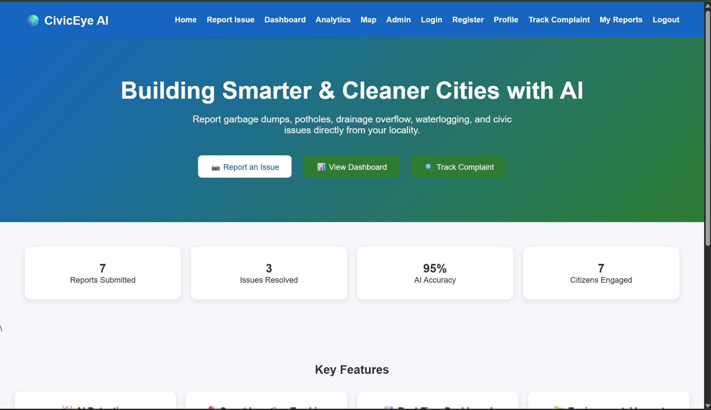
</p>

### Features & Workflow

<p align="center">
  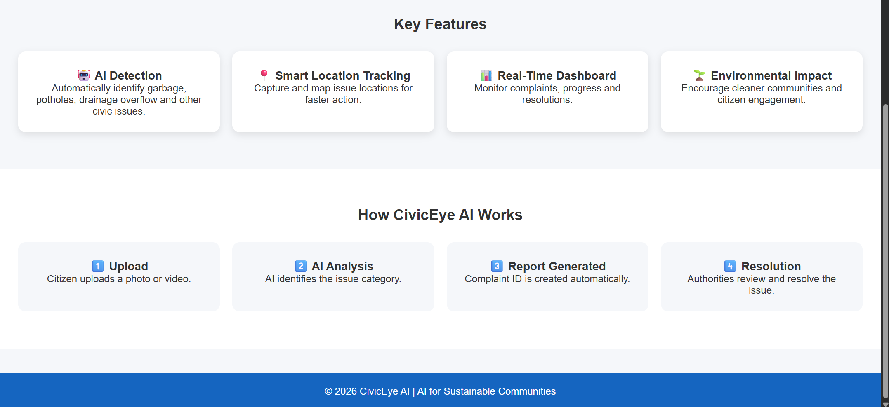
</p>

---

## 🔐 Login Page

<p align="center">
  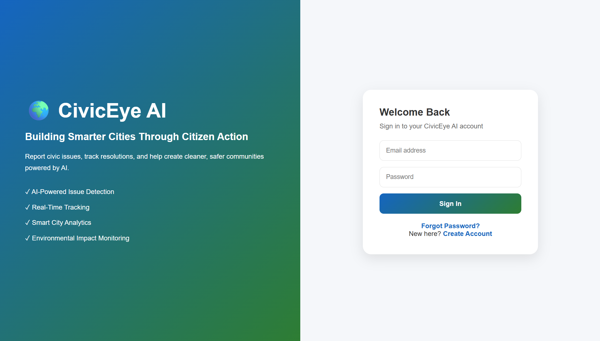
</p>

---

## 🆕 Registration Page
<p align="center">
  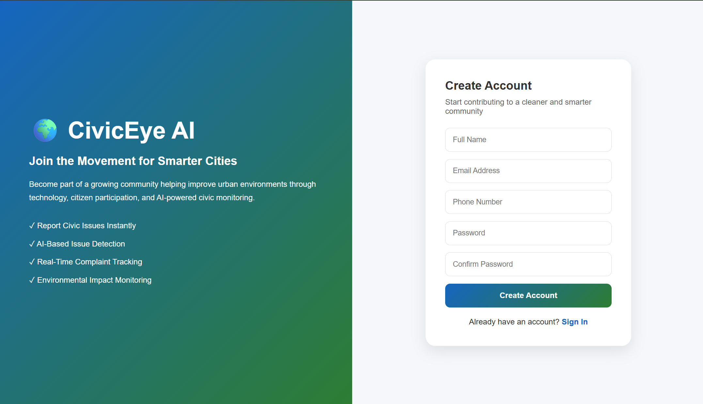
</p>

---

## 📝 Complaint Submission

<p align="center">
  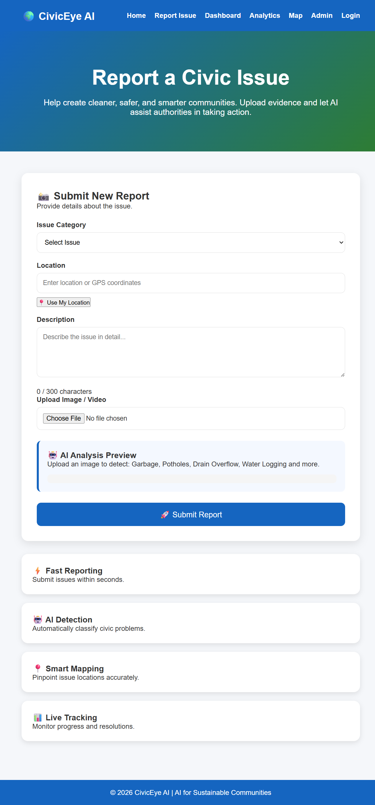
</p>

---

## 🤖 AI Prediction

<p align="center">
  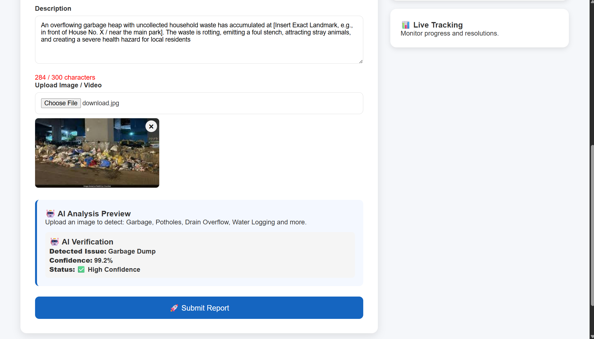
</p>

---

## 📋 My Reports

<p align="center">
  
</p>

---

## 👤 User Profile

<p align="center">
  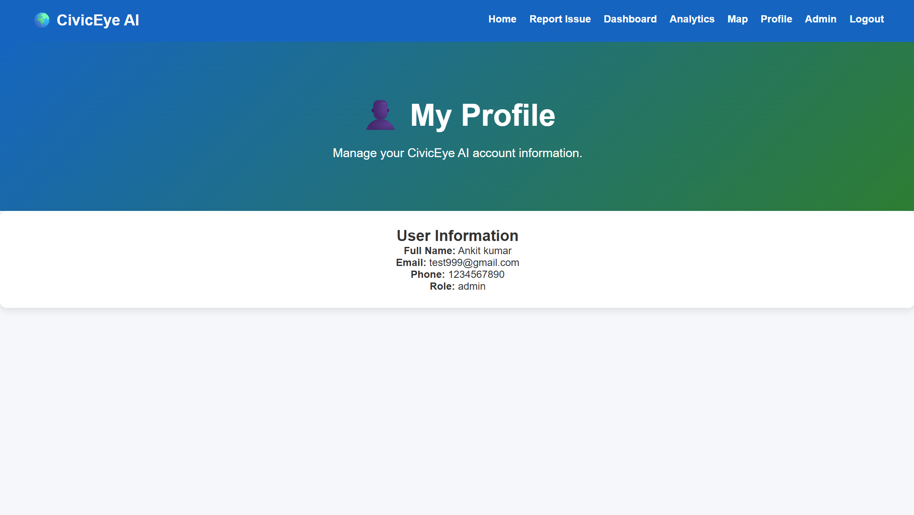
</p>

---

## 📍 Interactive Map

<p align="center">
  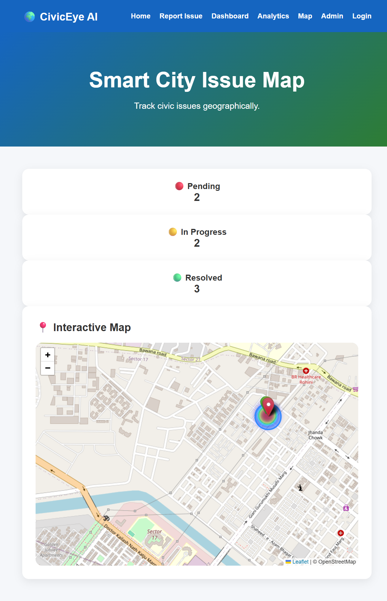
</p>

---

## 📊 Analytics Dashboard

### Analytics Overview

<p align="center">
  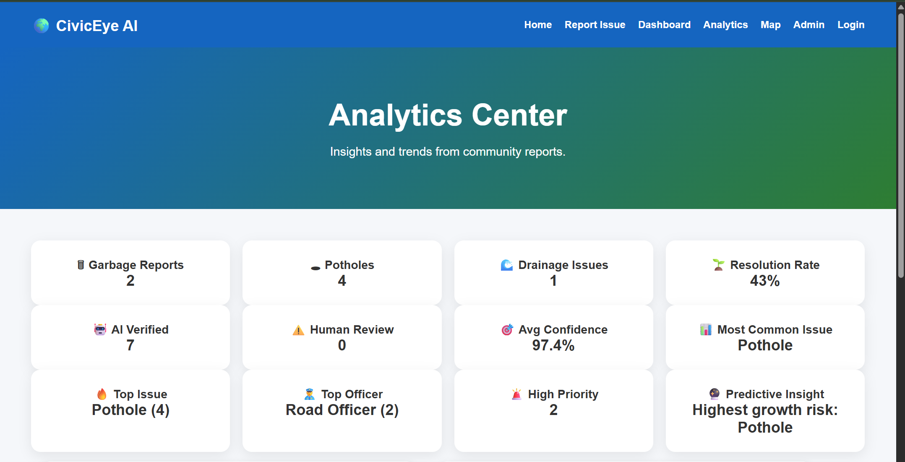
</p>

### Analytics Insights

<p align="center">
  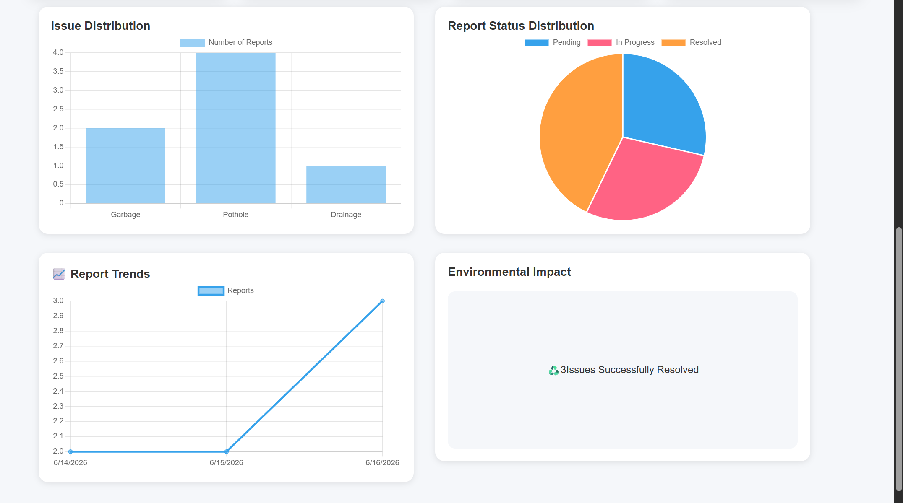
</p>

---

## 📈 Civic Dashboard

<p align="center">
  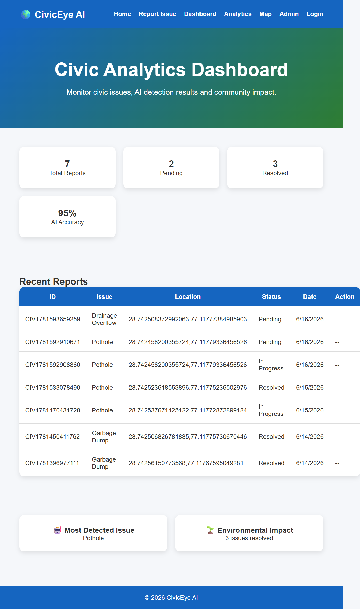
</p>

---

## 👨‍💼 Admin Dashboard

### Admin Control Center

<p align="center">
  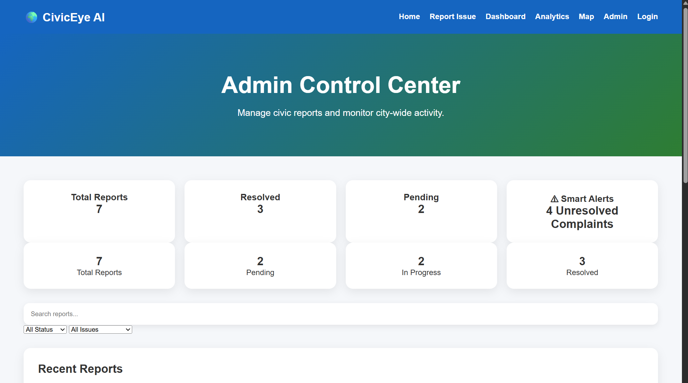
</p>

### Complaint Management & Statistics

<p align="center">
  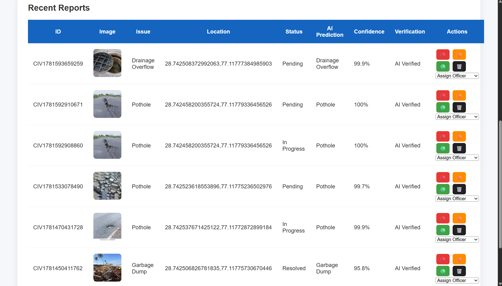
</p>

---

## 🔥 Complaint Heatmap

<p align="center">
  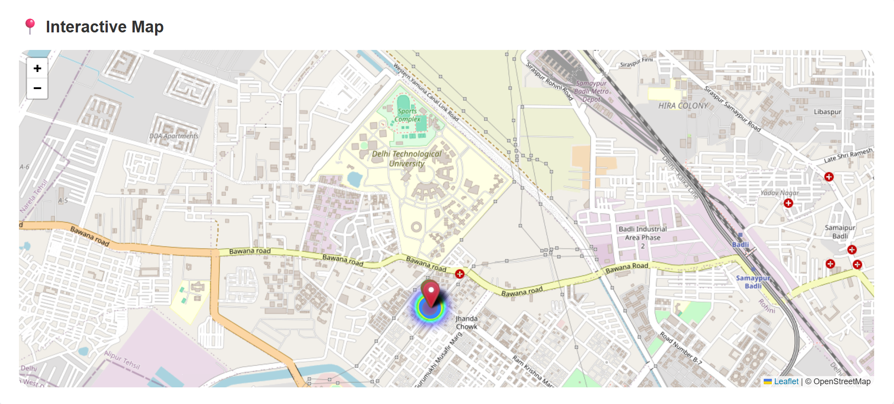
</p>

<p align="center">
  <em>AI-powered heatmap highlighting civic issue hotspots across the city for improved resource allocation and faster response.</em>
</p>

---

# 🚀 Future Scope

- AI-Based Severity Prediction
- Duplicate Complaint Detection
- Automatic Authority Assignment
- Email Notifications
- Mobile Application
- PostgreSQL Migration
- Docker Deployment
- Cloud Deployment
- Predictive Analytics

---

# 👨‍💻 Author

**Ankit Kumar**

B.Tech Computer Science & Engineering

Delhi Technological University

GitHub:
https://github.com/ankitsharma062

LinkedIn:
(Add LinkedIn URL)

---

# ⭐ Support

If you found this project useful, consider giving it a ⭐ on GitHub.